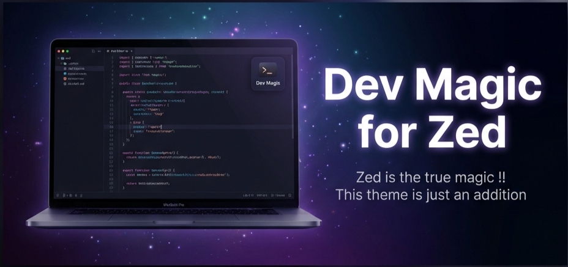

# Dev Magic Theme for Zed



<p align="center">
	<a href="https://github.com/susanta96/dev-magic/stargazers"></a>
	<a href="https://github.com/susanta96/dev-magic/issues"></a>
	<a href="https://github.com/susanta96/dev-magic/contributors"></a>
</p>

---

**Dev Magic** is a premium, high-contrast theme collection designed for the Zed editor. It provides a soothing yet vibrant coding experience with deeply saturated dark modes and crisp, legible light modes.


## ✨ Features

*   **Dev Magic (Dark)**: A deep "Obsidian" background with magical Violet, Teal, and Peach accents.
*   **Dev Magic (Light)**: A clean, high-readability light theme based on the "Moonlight" palette for daytime coding.
*   **Optimized Contrast**: Carefully balanced text colors to reduce eye strain while maintaining vibrancy.
*   **Semantic Highlighting**: Distinct colors for functions, keywords, and types to make code structure clear.

## 📦 Installation

Since Zed themes are currently installed via extensions:

1.  Clone this repository:
    ```bash
    git clone https://github.com/susanta96/dev-magic.git
    ```
2.  Open Zed.
3.  Go to **Extensions** (`Cmd-Shift-X`).
4.  Click **Install Dev Extension** and select the folder where you cloned this repo.
5.  Open the Theme Selector (`Cmd-K` then type `theme`).
6.  Select **Dev Magic (Dark)** or **Dev Magic (Light)**.

## 🎨 Palette Preview

| Color | Hex | Usage |
| :--- | :--- | :--- |
| **Obsidian** | `#0b0e14` | Editor Background |
| **Magic Violet** | `#a5b4fc` | Accents, Focus Borders |
| **Sky Teal** | `#2dd4bf` | Properties, Functions |
| **Soft Peach** | `#f472b6` | Strings |
| **Slate** | `#94a3b8` | Comments, Muted Text |

## 📄 License

This project is licensed under the [MIT License](LICENSE).
